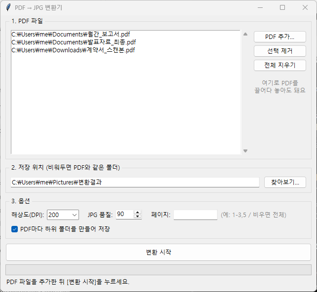

# PDF → JPG 변환기 (PDF to JPG Converter)

[](https://github.com/Hakhyun-Kim/pdf-to-jpg/actions/workflows/release.yml)
[](https://github.com/Hakhyun-Kim/pdf-to-jpg/actions/workflows/pages.yml)
[](LICENSE)

PDF 파일을 페이지별 JPG 이미지로 변환하는 프로그램입니다. **웹 버전**과 **데스크톱 버전**(Windows / macOS / Linux)을 제공합니다.

A simple tool that converts PDF pages into JPG images. Available as a web app and a desktop GUI (Python + tkinter + PyMuPDF).

<p align="center">
  
</p>

## 🌐 웹에서 바로 사용 (설치 불필요)

**→ https://hakhyun-kim.github.io/pdf-to-jpg/**

브라우저에서 바로 변환할 수 있습니다. 파일은 **서버로 전송되지 않고** 내 컴퓨터(브라우저) 안에서만 처리됩니다.

## 💾 데스크톱 버전 다운로드

**→ [최신 릴리스 다운로드](https://github.com/Hakhyun-Kim/pdf-to-jpg/releases/latest)**

| 플랫폼 | 파일 |
|--------|------|
| Windows | `PDF-to-JPG-Windows.exe` |
| macOS (Apple Silicon) | `PDF-to-JPG-macOS-AppleSilicon.zip` |
| macOS (Intel) | `PDF-to-JPG-macOS-Intel.zip` |
| Linux | `PDF-to-JPG-Linux.tar.gz` |

> **처음 실행 시 보안 경고가 뜬다면** (코드 서명이 없는 무료 배포판이라 나타나는 정상적인 경고입니다)
> - **Windows**: SmartScreen 경고 → "추가 정보" → "실행"
> - **macOS**: 압축을 푼 앱을 **우클릭 → 열기** (또는 터미널에서 `xattr -cr PDF-to-JPG.app`)

## 주요 기능

- 📄 **여러 PDF 동시 변환** — 파일 여러 개를 넣고 한 번에 일괄 처리
- 🖱️ **드래그 앤 드롭** — 탐색기에서 PDF를 끌어다 놓기만 하면 추가
- 🔍 **해상도(DPI) 선택** — 72 ~ 600 DPI (기본 200, 인쇄용은 300 이상 권장)
- 🎚️ **JPG 품질 조절** — 10 ~ 100 (기본 90)
- 📑 **페이지 범위 지정** — `1-3,5` 형식으로 원하는 페이지만 변환
- 📁 **자동 정리 저장** — PDF마다 하위 폴더를 만들어 `파일명_001.jpg`, `파일명_002.jpg` … 형식으로 저장
- ⏳ **진행률 표시** — 변환 중에도 창이 멈추지 않음

## 사용 방법

1. **PDF 추가...** 버튼을 누르거나, 파일 목록에 PDF를 드래그 앤 드롭
2. 저장 위치 선택 — 비워두면 각 PDF가 있는 폴더에 저장 (웹 버전은 ZIP으로 다운로드)
3. 옵션 설정 (해상도 / 품질 / 페이지 범위)
4. **변환 시작** 클릭

### 옵션 안내

| 옵션 | 설명 | 기본값 |
|------|------|--------|
| 해상도(DPI) | 클수록 선명하지만 파일 용량이 커짐. 화면용 150~200, 인쇄용 300+ | 200 |
| JPG 품질 | 10~100. 높을수록 화질이 좋고 용량이 커짐 | 90 |
| 페이지 | `1-3,5,8-10` 형식. 비우면 전체 페이지 변환 | 전체 |
| 하위 폴더 | PDF마다 폴더를 만들어 저장 (여러 PDF 변환 시 깔끔) | 켜짐 |

## 파이썬 소스로 직접 실행

### 1. Python 설치

[python.org](https://www.python.org/downloads/)에서 Python 3.10 이상을 설치합니다.
(Windows 설치 시 **"Add Python to PATH"** 체크 필수)

### 2. 라이브러리 설치

```bash
pip install -r requirements.txt
```

> `tkinterdnd2`는 드래그 앤 드롭 기능용입니다. 설치하지 않아도 프로그램은 작동합니다.

### 3. 실행

- Windows: **`PDF변환기 실행.bat`** 더블클릭 (콘솔 창 없이 실행됨)
- 또는 터미널에서: `python pdf_to_jpg.py`

## 동작 원리

- **데스크톱**: [PyMuPDF](https://pymupdf.readthedocs.io/) (MuPDF 엔진)로 PDF 페이지를 지정한 DPI로 렌더링한 뒤 JPG로 저장. 외부 프로그램 설치 불필요.
- **웹**: [pdf.js](https://mozilla.github.io/pdf.js/)로 브라우저 안에서 렌더링 후 JPG로 변환, [JSZip](https://stuk.github.io/jszip/)으로 묶어 다운로드. 서버 업로드 없음.

## 개발자용: 배포 방법

### 새 버전 릴리스 (설치 파일 자동 빌드)

버전 태그를 푸시하면 GitHub Actions가 Windows / macOS(Apple Silicon·Intel) / Linux 실행 파일을 빌드해 릴리스에 자동 첨부합니다.

```bash
git tag v1.0.0
git push origin v1.0.0
```

### 웹 버전 배포

`main` 브랜치의 `web/` 폴더가 바뀌면 GitHub Pages로 자동 배포됩니다.
최초 1회 저장소 **Settings → Pages → Build and deployment → Source**를 **"GitHub Actions"** 로 설정해야 합니다.

## 라이선스

[MIT License](LICENSE)
